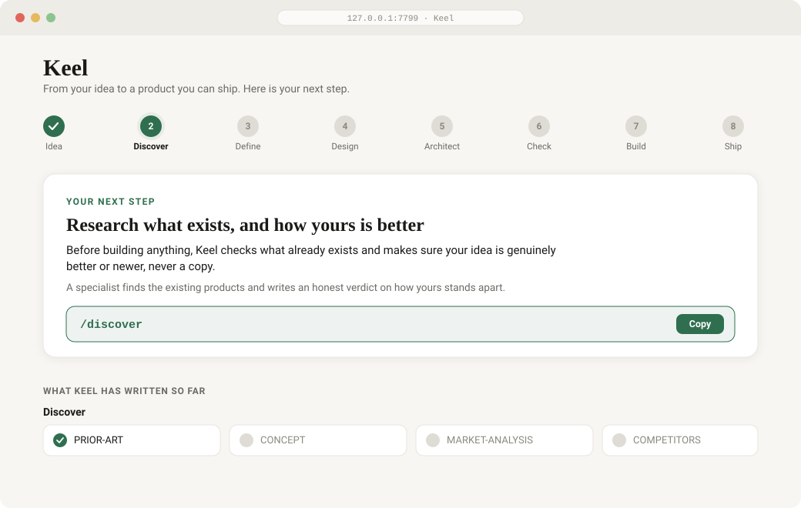
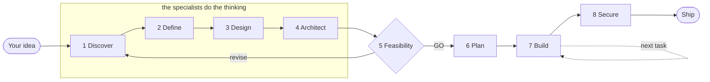

<div align="center">

# Keel

### Build a real product from one idea, with an AI founding team.

**Keel is an open-source AI product builder that takes you from an idea to a shipped, production-grade product.** It does the market research, writes the business case, defines the product spec, designs the screens, plans the build, then writes and ships the actual code, tested and secured, by driving the AI coding tool you already use (Claude Code, Cursor, Codex, and more).

It is the tool for the part everyone skips: **knowing what to build and why, in what order, and proving it actually works before real users arrive.** And it is easy enough for a non-technical founder and rigorous enough for a senior engineer.

**Building a company or just a project?** Both. Keel runs in two shapes: a full **company** path (market, competitors, unit economics, go-to-market) or a lighter **project** path (skip the money work, just build something great). Either way one rule never bends: **it must be genuinely better or more original than what already exists. Never a clone, never the average version.**

</div>

<p align="center">
<a href="#install-it-start-here"><b>Install</b></a> ·
<a href="#use-it"><b>Use it</b></a> ·
<a href="#easy-by-design"><b>How it feels</b></a> ·
<a href="#how-keel-compares"><b>Compare</b></a> ·
<a href="#faq"><b>FAQ</b></a> ·
<a href="https://github.com/Bhargs24/keel"><b>GitHub</b></a>
</p>

<p align="center">

<br><sub>The guide (<code>python tools/keel.py</code>): it shows you the one next step, in plain words, and every document Keel writes.</sub>
</p>

---

## What is Keel?

Keel is a free, open-source system that turns a one-sentence idea into a complete, buildable, shippable product. Think of it as an **AI founding team in your terminal**: a business analyst, a market researcher, a product manager, a designer, a software architect, a QA engineer, and a security auditor, each an AI specialist that does its part of the 0 to 1 work and hands you a real deliverable.

Most AI tools help you generate a prototype in minutes. Keel helps you build a **real product**: one that is planned, designed, tested, secure, and grounded in an actual business case, using the AI coding tool you already pay for as the engine. You bring the idea and the decisions. Keel does everything else and tells you the single next step at every point.

**Keywords:** AI app builder, idea to MVP, idea to production, build a startup with AI, AI product manager, spec-driven development, AI market research, PRD generator, vibe coding done right, Claude Code workflow, Cursor workflow, open-source AI developer tool.

---

## The magic-wand loop



| Step | What happens |
|---|---|
| **1 · Discover** | The business case, or for a project, what already exists and how yours is genuinely better |
| **2 · Define** | The product spec: the target user's psychology, then every screen and every state |
| **3 · Design** | A distinctive design system and real screen mockups, never a template |
| **4 · Architect** | A justified tech stack, the data model, and a dependency-ordered build plan |
| **5 · Feasibility** | An honest audit of all three plans together. **GO / REVISE / NO-GO** |
| **6 · Plan** | The build roadmap becomes a tracked, ordered backlog |
| **7 · Build** | Keel writes and tests the real code, one task at a time |
| **8 · Secure** | It proves no user can read another user's data, then ships |

The research steps each spawn a **specialist AI subagent** that writes a real document, not a stub. The feasibility gate checks all three plans together: is the product coherent with the business, is it buildable with your tools, can you afford to run it? If not, it says `REVISE` and tells you exactly what to fix. And whenever Keel finds a weakness, in your idea, your product, or your code, **it never leaves you there. It always hands you the fix.**

---

## Does Keel actually write the code?

**Yes.** Keel is not just a planner. Once the plan passes the feasibility gate, Keel drives your AI coding tool through the entire build: it picks the next task, writes production-grade code (real data paths, every state, every error, no mocks or TODOs), writes the tests, proves the security, and moves to the next task. It writes the whole product.

What makes Keel different from using a coding agent on its own is the judgment around the code:

- it **works out what to build and why** (the business case and the product spec),
- it **builds in the right order** (a dependency-ordered plan, so nothing is built before the thing it needs),
- and it **proves the result is real** (`/audit` verifies "done" against a written definition of done, and `/secure` proves no user can read another user's data).

Raw coding agents write code fast and guess at the rest. Keel removes the guessing.

---

## Works with any AI tool (open or closed)

Keel is built in layers, and only the top one is tied to a specific tool:

| Layer | What it is | Tool it needs |
|---|---|---|
| **The brains** | the rulebook, the pipeline, the specs, the laws | none, they are just Markdown |
| **The tools** | the tracker, the quality gates, the security proof (trespass), the guide cockpit | just Python, works with **no AI at all** |
| **The integration** | slash commands, specialist agents, hooks, the plugin | **best in Claude Code** (native), works elsewhere via `AGENTS.md` |

So: **best with Claude Code**, where the commands, agents, hooks, and security gate are native. But it works with **any AI coding tool**, Cursor, Codex, Aider, Cline, Windsurf, Gemini CLI, open-source or closed, because every command is a prompt file the AI reads, and the repo ships an `AGENTS.md` (the emerging cross-tool standard) plus a Cursor rules file as the universal entry point. And the tracker, the gates, the security proof, and the guide run with no AI at all. Nothing here is locked to one vendor.

## Your project's own toolkit, found and vetted for you

You should not have to know which open-source tools, skills, or MCP servers your project needs. **`/equip`** sends a **tool-scout** to find them, for your exact stack: the MCP servers the AI can use, the Claude Code skills and plugins, the dev and quality tools, the libraries. It **vets every one for safety** (what it does, what it can access, whether it touches your data or secrets) and recommends a small, focused set, because piling on twenty tools just costs the AI focus. Anything that could touch your data or credentials is never added without your explicit yes. The vetted list lives in your repo, and the safe tools get wired in for you.

## Install it (start here)

### What you need first

1. **Python 3.10 or newer.** Check with `python --version`. Get it from [python.org](https://www.python.org/downloads/) (tick "Add Python to PATH" on the first screen).
2. **An AI coding tool.** [Claude Code](https://claude.com/claude-code) is the smoothest fit. Cursor, Codex, or any tool that reads files and runs commands also works.
3. **Git.** From [git-scm.com](https://git-scm.com/downloads) if `git --version` fails. (Keel's installer can set your project up if this is missing.)

### The easiest way (recommended for everyone)

```bash
git clone https://github.com/Bhargs24/keel
cd keel
python install.py ~/my-product      # the folder for your new product
```

The installer is a concierge: it creates the folder, sets up version control, asks "is it just you building this?" with no jargon, and offers to open the guide.

Then open the **guide**, which shows you the next step at every point:

```bash
cd ~/my-product
python tools/keel.py
```

Your browser opens to a friendly cockpit: a progress rail from Idea to Ship, one plain-English "your next step" card with the exact words to copy, and every document Keel writes, readable in the browser. **Open the guide, do the step it shows, refresh, repeat, until you have shipped.**

### The developer way (install as a Claude Code plugin)

```
/plugin marketplace add Bhargs24/keel
/plugin install keel
```

Then run `python install.py <your-repo>` once to lay down the project structure, and use the commands in that repo.

> **On Windows?** Everything works. Use `python tools/run.py check` wherever older docs say `make check`. Keel prefers the Python runner so nothing depends on tools you may not have.

---

## Use it

**You do not drive the tools. Keel does.** You say what you want in plain words; it picks the next step, runs it, and tells you in one line what happened. When something is genuinely your call (a name, a budget, a real trade-off), it asks. Otherwise it proceeds.

**The whole thing, in three moves:**

1. **Give it your idea.** In the guide, or by typing `/keel "your idea in a sentence"` in your AI tool.
2. **Approve each step.** Keel researches the business, defines the product, designs it, plans the build, and audits whether it holds together, pausing at each gate to show you what it found.
3. **When it says GO, it builds** the product, task by task, testing and securing as it goes. Ask `/next` any time to see what is next.

**Already have a spec?** Drop your documents into `spec/`, run `/plan`, then `/work`.

**The three commands to remember:** `/start` when you sit down, `/next` to find out what to do, `/wrap` when you stop. Everything else, Keel reaches for on your behalf.

---

## Easy by design

Keel is built so a first-time builder never freezes. It talks the way a good mentor does: **one short question at a time, in plain words**, and it never dumps a wall of steps on you. The long plans and the details live in the guide and the documents. The conversation stays calm.

<p align="center">

</p>

Two rules make this true, and they run on every message:

- **The conversation law:** one question at a time, short plain answers, no jargon, and the depth kept in the guide rather than pasted into the chat.
- **The paired-honesty law:** whenever Keel finds a weakness in your idea, product, or code, it hands you the fix in the same breath. It is never only a critic, and never a wall of problems with no way forward.

---

## How Keel compares

| | Prompt-to-app builders<br/><sub>(Lovable, Bolt, v0, Base44)</sub> | A raw AI coding agent<br/><sub>(Claude Code, Cursor alone)</sub> | **Keel** |
|---|:---:|:---:|:---:|
| Writes working code | Prototype | Yes | **Yes, production-grade** |
| Market and competitor research | No | No | **Yes** |
| A real product spec (PRD) | No | No | **Yes** |
| A distinctive design system | Partial | No | **Yes** |
| Feasibility audit before building | No | No | **Yes** |
| Dependency-ordered build plan | No | No | **Yes** |
| Verifies "done" is really done | No | No | **Yes (`/audit`)** |
| Proves security (no data leaks) | No | No | **Yes (`trespass`)** |
| Uses the AI tool you already pay for | No (locked in) | Yes | **Yes** |
| Open source, yours to keep | No | No | **Yes (MIT)** |

Prompt-to-app builders are great for a quick demo, then you hit the wall: no real spec, no plan, no proof it works, and you are locked into their platform. A raw coding agent writes code fast but guesses at what to build and whether it is right. **Keel gives you the whole path, and you own it.**

---

## What Keel produces

A complete, professional document set plus the working product:

- **Business:** the company narrative, positioning against a real moat (the 7 Powers, not hand-waving), market and competitor analysis, unit economics stress-tested with a downside case, a pre-mortem, and the real monthly cost to run, rebuilt from prices checked today rather than trusted.
- **Product:** it starts with the person, the target user's psychology and the behaviour the product has to create, not a feature list. Then a master PRD and per-module specs with prioritized, testable requirements, jobs-to-be-done, success metrics, and every screen state, so the product is built around how people actually think and act.
- **Design:** a design brief, a design system (colors, type, components), and real HTML mockups of the key screens.
- **Technical:** the architecture, a justified tech stack, the data model, the accounts to set up, and a dependency-ordered build roadmap.
- **The product itself:** production-grade code, tests that cover the risk, and a security proof, built task by task and tracked in git.

---

## The specialists

Each is a focused AI mind with a clean context and one job, defined in `.claude/agents/`.

| Agent | Owns |
|---|---|
| **business-analyst** | the narrative, business model, unit economics, the moat, a pre-mortem |
| **market-researcher** | market sizing, the competitor field, the wedge, incumbent-response war-gaming |
| **product-manager** | the target user's psychology and behaviour, then the PRD, prioritized testable requirements, and every screen state |
| **design-lead** | the design brief, the design system, real screen mockups |
| **tech-architect** | architecture, stack, data model, the build roadmap |
| **feasibility-auditor** | the cross-check of all three plans, with a GO / REVISE / NO-GO verdict |
| **code-reviewer** | the gap a grep cannot find, before a push |
| **qa** | tests that cover the risk, not just the happy path |
| **security-auditor** | the permission and data boundaries |
| **tool-scout** | finding and vetting the open-source tools, skills, and MCP servers your project needs |

---

## trespass: security you can prove

Broken access control, one user able to read or delete another user's data, is the single most common way AI-built apps leak, and the one class ordinary scanners cannot catch, because catching it needs to know who is *supposed* to see what.

Keel ships **trespass**, a formal analyzer for Postgres and Supabase row-level security. It compiles every policy into logic and either **proves** no user can reach another's rows, or hands you the exact query that shows they can:

```
VULNERABLE  critical   [tenant-read]
  Your policy:  user_id = auth.uid() OR is_public
  Reproduce it:  select * from documents;   -- returns another user's rows
```

Written from scratch on the standard library, validated against Z3 and a real Postgres, it runs in the gates and in `/secure`, and it fails your build when a policy leaks. Details: [`tools/trespass/README.md`](template/tools/trespass/README.md).

---

## FAQ

**Is Keel free?**
Yes. Keel is open source under the MIT license. You only pay for the AI coding tool you already use (like Claude Code or Cursor).

**Do I need to know how to code to use Keel?**
No. The guided cockpit shows you the one next step in plain English and gives you the exact words to paste. Keel does the technical work; you make the decisions it surfaces. It is also rigorous enough for professional engineers.

**Does Keel write the actual code, or just documents?**
Both. It writes the full business and product plan, and then it writes and ships the actual product code, tested and secured, by driving your AI coding tool.

**What AI tools does Keel work with? Open source or closed?**
Any of them. Claude Code fits most smoothly (Keel installs as a plugin, with native commands, agents, and hooks). It also works with Cursor, Codex, Aider, Cline, Windsurf, Gemini CLI, and any other AI coding tool, open-source or closed, because the commands are prompt files and the repo ships a universal `AGENTS.md` plus a Cursor rules file. The tracker, the quality gates, the security proof, and the guide are plain Python and work with no AI at all. Nothing is locked to one vendor.

**Does Keel find and set up the right open-source tools for my project?**
Yes. `/equip` sends a tool-scout to find the MCP servers, skills, and libraries your specific stack needs, vets each one for safety (what it can access, whether it touches your data), recommends a small focused set, and wires in the safe ones. Anything that could reach your data or secrets is never added without your explicit yes.

**How is Keel different from Lovable, Bolt, v0, or Replit?**
Those generate a prototype from a prompt, then leave you at the wall with no spec, no plan, and no proof it works, locked into their platform. Keel does the research, the spec, the design, the plan, and the proof, and builds with the tool you already own, on code you keep.

**How is it different from just using Claude Code or Cursor directly?**
A coding agent writes code fast but guesses at what to build and whether it is right. Keel adds the founding-team judgment: what to build, why, in what order, and proof that it works, with a feasibility gate before a line of code.

**Can Keel build a SaaS app? A mobile app? An MVP?**
Yes. Keel is stack-agnostic. The architect chooses and justifies the right technology for your product, whether that is a web app, a SaaS, a mobile app, or an API.

**Does it work on Windows?**
Yes, fully. Use `python tools/run.py check` where docs mention `make`.

**Is my idea and code private?**
Yes. Everything lives in your own git repository on your machine. Keel stores nothing.

**Do I have to turn my idea into a company?**
No. Keel has a **project** mode for when you just want to build something great, a tool, an app, a game, a library, without the market sizing, unit economics, or go-to-market. It skips the business work but keeps the design, the product quality, and the proof that it works.

**Will it just clone what already exists?**
Never, on purpose. Before building, Keel researches what is already out there and holds a hard rule: your idea must be meaningfully better or more original, or it says so and helps you find the angle that makes it new. It will not build you the average version of something that already exists.

**Can a solo, non-technical founder really ship with this?**
That is exactly who it is built for, alongside professional teams. The installer, the guide, and the "tell me the next step" design assume you do not know the commands, and never make you feel like you should.

---

## Who Keel is for

- **Founders and indie hackers** turning an idea into a fundable, buildable, shippable product.
- **Product managers and designers** who want a spec, a plan, and a build that follows them.
- **Engineers and small teams** who want AI speed without losing quality, ownership, or security.
- **Anyone hitting the wall** with a prompt-to-app tool and needing to reach real production.

---

## Why I built Keel

I'm **Bhargav**. Before this, I shipped a product on my own, end to end: two mobile apps live on the App Store and Google Play, a backend, three web consoles, five languages in production, used by real students, in about three months. I did every side of it myself, the business, the product, and the engineering, and took it from an idea all the way to something people used.

Doing that alone taught me where the difficulty actually is. When AI can write code this fast, building stops being the bottleneck. The hard part, the part that decides whether what you ship is any good, is knowing **what** to build and **why**: the business, the product and the person it is for, the technical shape, and the order to build it in. The tools out there turn a spec into code brilliantly, and every one of them assumes you already wrote that spec. Most people have not, and the people who need it most are often the least sure what a good one contains.

So I built Keel to be the thing I wish I had had: it does that thinking with you, whether you are a seasoned engineer or someone who has never written a line of code, and then it keeps the build honest against it, all the way to production. It carries the product and business judgment I learned building solo, so you do not have to learn it the slow way too.

---

## The ideas it is built on

1. **Anything a person must remember is a rule that will eventually be broken.** So a rule must run, be checked, or be short enough to hold.
2. **The AI is the operator, not the instructor.** It never tells you to run a command it can run itself.
3. **Every weakness travels with its fix.** Keel can tell you your idea is weak because it never leaves you there.
4. **Choosing what to build next is a machine's job.** `/next` ranks the candidates and shows the reason.
5. **"Done" is verified, not declared.** `/audit` walks a task against its written definition of done.
6. **"Secure" is proven, not assumed.** `/secure` proves the permission boundary rather than trusting it.
7. **Feasibility is a gate, not a hope.** The business, the product, and the build are audited together before you build on them.

---

<div align="center">

**Give it an idea. Watch it become a plan you can build, and then the product itself.**

Open source (MIT). Star it, use it, contribute.

*AI product builder · idea to production · AI founding team · spec-driven development · works with Claude Code and Cursor*

</div>
