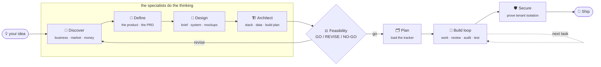

<div align="center">

# Keel

### From an idea to a product you can ship. Properly.

**Keel is an AI founding team that lives in your terminal.** You give it one idea. It runs the real 0→1 work - business case, market and competitor research, a proper product spec, the technical architecture, a feasibility audit, and a dependency-ordered build plan - and then it builds the thing under quality gates that don't let it cut corners.

All you need is a subscription to an AI coding tool you already use (Claude Code, Cursor, Codex - anything that can run commands and read files).

*Not a framework. Not a prompt pack. A working operating system for taking software from nothing to production without it turning into a mess.*

</div>

---

## The magic-wand loop



Each box is a command. The first four spawn a **specialist subagent** that does the work and writes a real document - not a stub, not a summary. Between the plan and the build sits a **feasibility gate** that checks all three plans *together*: is the product coherent with the business, is it buildable with the tools you have, and can you afford to run it? If not, it says `REVISE` and tells you exactly what.

---

## Why this exists

Anyone can now generate a working-looking app from a prompt. Almost nobody can get it to a *real* product - because the hard part was never the typing. It's knowing **what** to build and **why**, in **what order**, and proving it actually works before real users arrive. That's the part the current wave of tools skips, and it's the part that decides whether you ship or drown.

Keel is built on one idea:

> **Anything a person has to remember is a rule that will eventually be broken.**

So Keel doesn't hand you a checklist and wish you luck. Every rule here either **runs automatically**, is **checked mechanically**, or is on a list short enough to actually hold. The AI is the operator - it chooses the next step, spawns the right specialist, writes the doc, claims the task, runs the checks, and tells you in one line what it did. You approve; you don't administrate.

---

## What you get

| | |
|---|---|
| 🧠 **A team of specialists** | Business analyst, market researcher, product manager, tech architect, feasibility auditor, code reviewer, QA, security auditor - as subagents, each with its own brief and its own quality bar |
| 📚 **A real document set** | The company narrative, positioning, market & competitor analysis, unit economics, cost-to-run, a master PRD with module specs, the technical design, and a dependency-ordered build roadmap - in the formats a fundable startup actually uses |
| ⚖️ **Feasibility, before you build** | The three plans are audited alone and together. Coherent, buildable, affordable. A `GO / REVISE / NO-GO` verdict with reasons |
| 🗂️ **A tracker that is just files in git** | One markdown file per task. No database, no hosting, no account. It refuses to start a task whose dependencies aren't done, and tells you what a completion unblocks |
| 🧭 **"What do I do next?", answered** | `/next` decides - and it's allowed to say the best next move isn't code. `/status` tells you which phase you're in and what's blocking the finish line |
| 🚦 **Gates that run themselves** | No placeholder code, module boundaries, ownership, dependency integrity, secret scanning, and per-language lint/type/test - the same ones locally and in CI |
| 🛡️ **Security you can prove** | `/secure` runs **[trespass](#-trespass-security-you-can-prove)**, a formal analyzer that *proves* no user can read another user's data - or hands you the exact query that breaks it |
| 🤝 **Built for a team, safe for AI sessions** | An enforced ownership boundary so two people (or ten agent sessions) on one repo never quietly overwrite each other |

---

## The commands

Three you'll use constantly, the rest when you want them.

### The pipeline

| Command | What it does | Spawns |
|---|---|---|
| **`/keel "<idea>"`** | Capture the idea, clarify only what blocks progress, start the pipeline | orchestrator |
| **`/discover`** | The business case: narrative, positioning, market & competitor analysis, unit economics, cost-to-run | business-analyst · market-researcher |
| **`/define`** | The product: a master PRD, module specs, user stories, success metrics, flows | product-manager |
| **`/design`** | The look and feel: a design brief, a design system (tokens + components), and real screen mockups covering every state | design-lead |
| **`/architect`** | The build: architecture, tech stack, data model, tools & accounts, and the dependency-ordered **build roadmap** | tech-architect |
| **`/feasibility`** | Audits the three plans, alone and together. **GO / REVISE / NO-GO** | feasibility-auditor |
| **`/plan`** | Turns the build roadmap into tracker tasks with dependencies | - |

### The build loop

| Command | What it does |
|---|---|
| **`/start`** | Where things stand, what the last session did, what's ready. Stops without starting anything |
| **`/work`** | **Decides what to build next**, verifies the ground is solid, then runs the ceremony on your yes |
| **`/next`** | Just the recommendation - what to do next and why. Allowed to say "not code" |
| **`/spec`** | What the specification actually says about a step, screen, or topic - quoted, with what it *doesn't* cover |
| **`/review`** | The gap between green CI and actually right: spec drift, silent failure, PII in logs, happy-path-only tests |
| **`/audit`** | **Is what we marked done actually done?** Clause by clause against its definition of done - and it moves failures back |
| **`/test`** | Runs the suite, reads the failures, and tells you what's actually broken |
| **`/secure`** | Proves tenant isolation with **trespass**, then a security review of the rest |
| **`/ship`** | The production-readiness gate, then deploy |
| **`/wrap`** | Honest state to the tracker, handoff, changelogs, checks, commit |
| **`/status`** · **`/board`** | Where the whole project is · the board, in a browser |

---

## The specialists

The front of the pipeline is run by subagents, each defined in `.claude/agents/`. They exist so the thinking is done by a focused mind with a clean context and one job - not squeezed into the middle of a coding session.

| Agent | Owns | Refuses to |
|---|---|---|
| **business-analyst** | the narrative, positioning, business model, unit economics | invent a market size or a moat that isn't there |
| **market-researcher** | TAM/SAM/SOM, the competitor field, the wedge | copy a competitor without saying why you win |
| **product-manager** | the PRD, user stories, success metrics, every screen state | leave a state, an error, or an edge case unspecified |
| **design-lead** | the design brief, the design system, real screen mockups | ship the generic AI-default look, or mock only the happy path |
| **tech-architect** | architecture, stack, data model, the build roadmap | choose a stack it can't justify, or a plan with steps out of order |
| **feasibility-auditor** | the cross-check of all three plans | pass a plan for want of checking - its verdict can be NO-GO |
| **code-reviewer** | the gap a grep can't find, before a push | approve a change that builds something adjacent to the spec |
| **qa** | tests that cover the risk, not just the happy path | call a thing tested when the thing most likely to break isn't |
| **security-auditor** | the permission and data boundaries | assert isolation when trespass can prove it |

---

## 🛡️ trespass: security you can prove

Broken access control - one user able to read or delete another user's data - is the single most common way AI-built apps leak, and the one class ordinary scanners **structurally cannot catch**, because catching it needs to know who is *supposed* to see what.

Keel ships **trespass**, a formal analyzer for Postgres / Supabase row-level security. It compiles every policy into logic and either **proves** no tenant can reach another's rows, or hands you the exact query that shows they can:

```
✗ VULNERABLE  critical   [tenant-read]
  Your policy:  user_id = auth.uid() OR is_public
  Counterexample (from the solver):
      session  auth.uid() = attacker
      row      user_id = victim, is_public = true
  Reproduce it:  select * from documents;   -- returns victim's rows to attacker
```

It's zero-dependency, it runs in `make check` and `/secure`, and it fails your build when a policy leaks. Details: [`tools/trespass/README.md`](template/tools/trespass/README.md).

---

## The document set it produces

Generated into `spec/` and `docs/`, in dependency order, each drawing from the one before it:

```
spec/
  00-START-HERE/   the program plan · the doc register (what's written, what's next)
  01-Company/      narrative · vision/mission/values · one-pager · positioning · how-we-pitch
  02-Product/      PRD (master) · prd/M1..Mn (module specs) · user stories · success metrics · flows
  03-Technical/    technical design · tech-stack · data model & events · security/privacy
                   · BUILD-ROADMAP · tools & accounts checklist
  04-Business/     market analysis · competitor analysis · GTM · business model & pricing · unit economics
  05-Finance/      cost-to-run model · financial model · fundraise ask
  06-Design/       design brief · design system (tokens + components) · screen mockups

docs/
  00-RULES/        the one book, and the depth behind it (code · delivery · testing · docs · ownership)
  01-INDUCTION/    start here · every command · how we work
  02-GUIDE/        how to get maximum speed out of this without losing quality
  10-STATUS/       NOW.md - what is claimed right now
  20-WORK/         the ownership map, sprints, backlog work items, crossings
  50-AUDITS/       dated, never edited after the fact - the feasibility and readiness audits
  99-TEMPLATES/    PRD module · work item · decision record · handoff · audit
```

Two document classes do a lot of the work: **LIVING** carries a review date and is expected to change; **SNAPSHOT** is dated and *never edited after that date* - because an audit that gets quietly corrected is not a record of anything.

---

## Install

```bash
python install.py /path/to/your/repo
```

It asks who's on the team, writes the roster and a starting ownership map, installs the git hooks, and **skips anything that already exists** rather than overwriting it. `--force` to overwrite, `--dry-run` to look first.

Then, from inside your repo, in your AI coding tool:

```
/keel "a booking tool for pet groomers that stops double-booking"
```

and follow where it takes you. Or, if you already have a spec, jump straight to `/plan` and `/work`.

---

## The ideas it's built on

You can throw away every file here and keep these.

1. **Anything a person must remember is a rule that will eventually be broken.** So a rule must run, be checked, or be short enough to hold. The test for any new rule: *can this be a check?* If yes, it must be.
2. **The AI is the operator, not the instructor.** It never tells you to run a command it can run itself.
3. **Choosing what to build next is a machine's job.** A person holds a dependency graph badly. `/next` ranks the candidates and shows the reason - and is allowed to say the answer isn't code.
4. **"Done" must be verified, not declared.** `/audit` walks a task against its written definition of done, and its fourth verdict is *CANNOT VERIFY*, so nothing passes for want of checking.
5. **The boundary between people is a check, not a courtesy.** An AI session has no sense of whose work it's standing in, so ownership is enforced in CI, not requested in a doc.
6. **Prove a capability on a bench before wiring it in.** And prove the permission boundary rather than trusting it - that's what `/secure` is.
7. **Feasibility is a gate, not a hope.** The business, the product, and the build are audited together before a line of code is written on top of them.

---

## What this is not

**Not a code generator.** It orchestrates the one you already pay for. It's the judgment around it - what to build, why, in what order, and whether it's actually right.

**Not opinionated about your stack.** The architect chooses and justifies; the gates are language-agnostic.

**Not a substitute for thinking.** It does the 0→1 legwork and holds the quality bar. You still make the calls it surfaces.

---

<div align="center">

**Give it an idea. Watch it become a plan you can build, and then the thing itself.**

MIT licensed. Contributions welcome.

</div>
