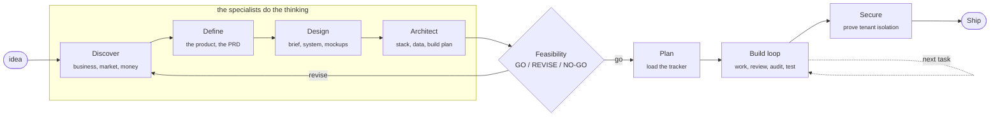

<div align="center">

# Keel

### From an idea to a product you can ship. Properly.

**Keel is an AI founding team that lives in your terminal.** You give it one idea. It runs the real 0 to 1 work, business case, market and competitor research, a proper product spec, a distinctive design, the technical architecture, a feasibility audit, and a dependency-ordered build plan, and then it builds the thing under quality gates that will not let it cut corners.

All you need is a subscription to an AI coding tool you already use (Claude Code, Cursor, Codex, anything that can run commands and read files).

**And it is easy.** A friendly step-by-step guide shows you the one next thing to do, in plain English, all the way from your idea to a shipped product. You never have to remember a command. The hard machinery stays in the back.

</div>

---

## Contents

- [The magic-wand loop](#the-magic-wand-loop)
- [Install it (start here)](#install-it-start-here)
- [Use it](#use-it)
- [What you get](#what-you-get)
- [The commands](#the-commands)
- [The specialists](#the-specialists)
- [Security you can prove](#-trespass-security-you-can-prove)
- [The ideas it is built on](#the-ideas-it-is-built-on)
- [What this is not](#what-this-is-not)

---

## The magic-wand loop



Each box is a step. The research steps each spawn a **specialist subagent** that does the work and writes a real document, not a stub. Between the plan and the build sits a **feasibility gate** that checks all three plans together: is the product coherent with the business, is it buildable with the tools you have, and can you afford to run it? If not, it says `REVISE` and tells you exactly what to fix. And whenever Keel finds a weakness, in your idea, your product, or your code, **it never leaves you there. It always hands you the fix.** That is a rule, not a mood.

---

## Install it (start here)

### What you need first

1. **Python 3.10 or newer.** Check with `python --version`. If you do not have it, get it from [python.org](https://www.python.org/downloads/) (on the first screen, tick "Add Python to PATH").
2. **An AI coding tool.** [Claude Code](https://claude.com/claude-code) is the smoothest fit. Cursor, Codex, or any tool that can read files and run commands also works.
3. **Git.** Keel uses it for history and safety. Get it from [git-scm.com](https://git-scm.com/downloads) if `git --version` fails. (The installer can set up your project for you if this is missing.)

### The easiest way (recommended for everyone)

**1. Get Keel and run the installer.** In a terminal:

```bash
git clone https://github.com/Bhargs24/keel
cd keel
python install.py ~/my-product      # the folder for your new product
```

The installer is a concierge. It creates the folder if it does not exist, sets up version control for you, asks "is it just you building this?" (no jargon), and offers to open the guide. Answer the questions and say yes.

**2. Open the guide.** It shows you the next step, always:

```bash
cd ~/my-product
python tools/keel.py
```

Your browser opens to a friendly cockpit: a progress rail from Idea to Ship, one plain-English "your next step" card with the exact words to copy, and every document Keel writes, readable in the browser.

**3. Follow the steps.** Open your AI coding tool in that folder, paste the step the guide shows you, press enter. Come back, refresh the guide, do the next step. That is the whole loop.

### The developer way (install as a plugin)

If you use Claude Code and want the commands available directly:

```
/plugin marketplace add Bhargs24/keel
/plugin install keel
```

Then run `python install.py <your-repo>` once to lay down the project structure (`spec/`, `docs/`, `tools/`, the tracker), and use the commands in that repo.

> **On Windows?** Everything works. Where older guides say `make check`, use `python tools/run.py check` instead. Keel prefers the Python runner everywhere so nothing depends on tools you may not have.

---

## Use it

### The one thing to understand

**You do not drive the tools. Claude does.** You say what you want in plain words; it picks the next step, runs it, and tells you in one line what happened. When something is genuinely your call (a name, a budget, a real trade-off), it asks. Otherwise it proceeds. Your job is the decisions, not the administration.

### The whole thing, in three moves

1. **Give it your idea.** In the guide, or by typing `/keel "your idea in a sentence"` in your AI tool.
2. **Approve each step.** Keel researches the business, defines the product, designs it, plans the build, and audits whether it all holds together, pausing at each gate to show you what it found and ask before it goes on.
3. **When it says GO, it builds** the thing, task by task, testing and securing as it goes. Ask `/next` any time to see what is next.

### If you already have a spec

Drop your documents into `spec/`, run `/plan` to load the build plan, and `/work` to start building.

### The three commands to remember

> **`/start`** when you sit down. **`/next`** to find out what to do. **`/wrap`** when you stop.

Everything else, Claude reaches for on your behalf.

---

## What you get

| | |
|---|---|
| **A team of specialists** | Business analyst, market researcher, product manager, design lead, tech architect, feasibility auditor, code reviewer, QA, security auditor, as subagents, each with its own brief and its own quality bar |
| **A friendly guide** | A step-by-step cockpit that hides the complexity and shows you the one next thing, plus every document Keel writes, readable in your browser |
| **A real document set** | The company narrative, positioning, market and competitor analysis, unit economics (with a downside), cost-to-run, a master PRD with prioritized testable requirements, a design system with mockups, the technical design, and a dependency-ordered build roadmap |
| **Feasibility before you build** | The three plans are audited alone and together. Coherent, buildable, affordable. A `GO / REVISE / NO-GO` verdict with reasons and fixes |
| **Weakness always with a fix** | The paired-honesty law: every gap Keel names arrives with the concrete action that closes it. It is never only a critic |
| **A tracker that is just files in git** | One markdown file per task. No database, no account. It refuses to start a task whose dependencies are not done |
| **"What do I do next?", answered** | `/next` decides, and it is allowed to say the best next move is not code. `/status` tells you which phase you are in |
| **Gates that run themselves** | No placeholder code, module boundaries, ownership, dependency integrity, secret scanning, and per-language lint/type/test, the same locally and in CI |
| **Security you can prove** | `/secure` runs **trespass**, a formal analyzer that proves no user can read another user's data, or hands you the exact query that breaks it |
| **Serious code-quality rules** | Production-grade-or-nothing, hard size limits, an error-code taxonomy, a reuse discipline, and a real debugging protocol (root cause before fix, reproduce first) |

---

## The commands

Three you will use constantly, the rest when you want them.

### The pipeline

| Command | What it does | Spawns |
|---|---|---|
| **`/keel "<idea>"`** | Capture the idea, clarify only what blocks progress, start the pipeline | orchestrator |
| **`/discover`** | The business case: narrative, positioning, market and competitor analysis, unit economics, cost-to-run | business-analyst, market-researcher |
| **`/define`** | The product: a master PRD, module specs, user stories, success metrics, flows | product-manager |
| **`/design`** | The look and feel: a design brief, a design system, real screen mockups covering every state | design-lead |
| **`/architect`** | The build: architecture, tech stack, data model, tools and accounts, the build roadmap | tech-architect |
| **`/feasibility`** | Audits the three plans, alone and together | feasibility-auditor |
| **`/plan`** | Turns the build roadmap into tracker tasks with dependencies | |

### The build loop

| Command | What it does |
|---|---|
| **`/start`** | Where things stand, what the last session did, what is ready. Stops without starting anything |
| **`/work`** | Decides what to build next, verifies the ground, then runs the ceremony on your yes |
| **`/next`** | Just the recommendation, what to do next and why. Allowed to say "not code" |
| **`/spec`** | What the specification actually says about a step, screen, or topic |
| **`/review`** | The gap between green CI and actually right: spec drift, silent failure, PII in logs |
| **`/audit`** | Is what we marked done actually done? Clause by clause, and it moves failures back |
| **`/test`** | Runs the suite, reads the failures, tells you what is actually broken |
| **`/secure`** | Proves tenant isolation with trespass, then a security review of the rest |
| **`/ship`** | The production-readiness gate, then deploy |
| **`/wrap`** | Honest state to the tracker, handoff, changelogs, checks, commit |
| **`/status`**, **`/board`** | Where the whole project is, and the developer board |

---

## The specialists

Each is a focused mind with a clean context and one job, defined in `.claude/agents/`.

| Agent | Owns | Refuses to |
|---|---|---|
| **business-analyst** | the narrative, business model, unit economics (with a downside), the moat, a pre-mortem | invent a market size or a moat that isn't there |
| **market-researcher** | market sizing, the competitor field, the wedge, incumbent-response war-gaming | copy a competitor without saying why you win |
| **product-manager** | the PRD, prioritized testable requirements, JTBD, every screen state | leave a state, error, or requirement unspecified or untestable |
| **design-lead** | the design brief, the design system, real screen mockups | ship the generic AI-default look, or mock only the happy path |
| **tech-architect** | architecture, stack, data model, the build roadmap | pick a stack it can't justify, or a plan with steps out of order |
| **feasibility-auditor** | the cross-check of all three plans | pass a plan for want of checking, or issue a GO on a base case only |
| **code-reviewer** | the gap a grep can't find, before a push | approve a change that builds something adjacent to the spec |
| **qa** | tests that cover the risk, not just the happy path | call a thing tested when the risk isn't |
| **security-auditor** | the permission and data boundaries | assert isolation when trespass can prove it |

---

## trespass: security you can prove

Broken access control, one user able to read or delete another user's data, is the single most common way AI-built apps leak, and the one class ordinary scanners **structurally cannot catch**, because catching it needs to know who is *supposed* to see what.

Keel ships **trespass**, a formal analyzer for Postgres / Supabase row-level security. It compiles every policy into logic and either **proves** no tenant can reach another's rows, or hands you the exact query that shows they can:

```
VULNERABLE  critical   [tenant-read]
  Your policy:  user_id = auth.uid() OR is_public
  Counterexample (from the solver):
      session  auth.uid() = attacker
      row      user_id = victim, is_public = true
  Reproduce it:  select * from documents;   -- returns victim's rows to attacker
```

It is written from scratch on the standard library (a purpose-built SMT solver for the row-level-security fragment), validated against Z3 and against a real Postgres, it runs in the gates and in `/secure`, and it fails your build when a policy leaks. Details and its 441-test suite: [`tools/trespass/README.md`](template/tools/trespass/README.md).

---

## The ideas it is built on

You can throw away every file here and keep these.

1. **Anything a person must remember is a rule that will eventually be broken.** So a rule must run, be checked, or be short enough to hold. The test for any new rule: *can this be a check?* If yes, it must be.
2. **The AI is the operator, not the instructor.** It never tells you to run a command it can run itself.
3. **Every weakness travels with its fix.** The tool can tell you your idea is weak because it never leaves you there.
4. **Choosing what to build next is a machine's job.** `/next` ranks the candidates and shows the reason, and is allowed to say the answer is not code.
5. **"Done" is verified, not declared.** `/audit` walks a task against its written definition of done; its fourth verdict is *CANNOT VERIFY*, so nothing passes for want of checking.
6. **"Secure" is proven, not assumed.** `/secure` proves the permission boundary rather than trusting it.
7. **Feasibility is a gate, not a hope.** The business, the product, and the build are audited together before a line of code is written on top of them.

---

## What this is not

**Not a code generator.** It orchestrates the one you already pay for. It is the judgment around it: what to build, why, in what order, and whether it is actually right.

**Not opinionated about your stack.** The architect chooses and justifies; the gates are language-agnostic.

**Not a substitute for thinking.** It does the 0 to 1 legwork and holds the quality bar. You still make the calls it surfaces.

---

<div align="center">

**Give it an idea. Watch it become a plan you can build, and then the thing itself.**

MIT licensed. Contributions welcome.

</div>
